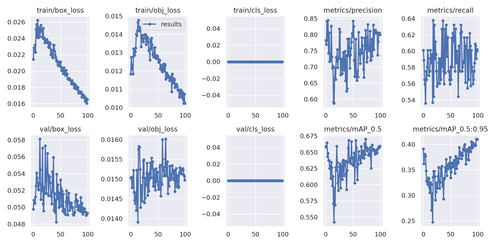
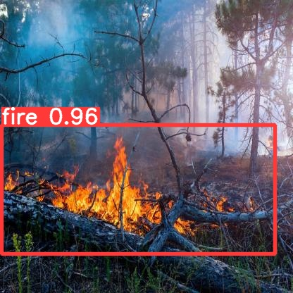
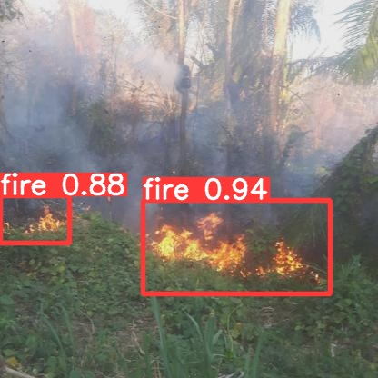
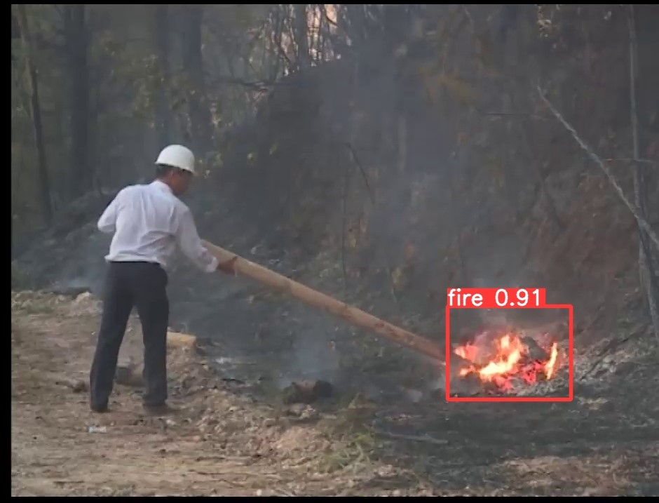

# Forest-Fire-Detection-YOLOv5
Forest Fire Detection YOLOv5

YOLO is one of the most widely used deep learning based object detection algorithms out there. We will train the YOLO v5 detector on a Forest fire dataset.

### Dataset

The dataset is collected from forest fire images on the internet.

### Training
Detail training steps in file yolov5_custom.ipynb

##### Step1: Mount Google drive

```python

import cv2
import matplotlib.pyplot as plt
import glob
from google.colab import drive


drive.mount('/content/gdrive')
%cd /content/gdrive/MyDrive/yolov5_new/src
```
##### Step2: Setting Up The YOLOv5 Environment

```python
!git clone https://github.com/ultralytics/yolov5  # clone yolov5 repo
!pip install -U -r yolov5/requirements.txt  # install dependencies

```

##### Step3: Download dataset

```python
!curl -L "https://app.roboflow.com/ds/path_your_dataset" > roboflow.zip; unzip roboflow.zip; rm roboflow.zip
```

##### Step4: Define Model Configuration and Architecture
1. data.yaml
```python
train: ./train/images # path to train images # CHANGED HERE
val: ./valid/images  # path to train images # CHANGED HERE

nc: 1
names: ['fire']

```
2. yolov5s.yaml

```python

# parameters
nc: 1  # number of classes  # CHANGED HERE
depth_multiple: 0.33  # model depth multiple
width_multiple: 0.50  # layer channel multiple

# anchors
anchors:
  - [10,13, 16,30, 33,23]  # P3/8
  - [30,61, 62,45, 59,119]  # P4/16
  - [116,90, 156,198, 373,326]  # P5/32

# YOLOv5 backbone
backbone:
  # [from, number, module, args]
  [[-1, 1, Focus, [64, 3]],  # 0-P1/2
   [-1, 1, Conv, [128, 3, 2]],  # 1-P2/4
   [-1, 3, BottleneckCSP, [128]],
   [-1, 1, Conv, [256, 3, 2]],  # 3-P3/8
   [-1, 9, BottleneckCSP, [256]],
   [-1, 1, Conv, [512, 3, 2]],  # 5-P4/16
   [-1, 9, BottleneckCSP, [512]],
   [-1, 1, Conv, [1024, 3, 2]],  # 7-P5/32
   [-1, 1, SPP, [1024, [5, 9, 13]]],
   [-1, 3, BottleneckCSP, [1024, False]],  # 9
  ]

# YOLOv5 head
head:
  [[-1, 1, Conv, [512, 1, 1]],
   [-1, 1, nn.Upsample, [None, 2, 'nearest']],
   [[-1, 6], 1, Concat, [1]],  # cat backbone P4
   [-1, 3, BottleneckCSP, [512, False]],  # 13

   [-1, 1, Conv, [256, 1, 1]],
   [-1, 1, nn.Upsample, [None, 2, 'nearest']],
   [[-1, 4], 1, Concat, [1]],  # cat backbone P3
   [-1, 3, BottleneckCSP, [256, False]],  # 17 (P3/8-small)

   [-1, 1, Conv, [256, 3, 2]],
   [[-1, 14], 1, Concat, [1]],  # cat head P4
   [-1, 3, BottleneckCSP, [512, False]],  # 20 (P4/16-medium)

   [-1, 1, Conv, [512, 3, 2]],
   [[-1, 10], 1, Concat, [1]],  # cat head P5
   [-1, 3, BottleneckCSP, [1024, False]],  # 23 (P5/32-large)

   [[17, 20, 23], 1, Detect, [nc, anchors]],  # Detect(P3, P4, P5)
  ]

```
##### Step5: Training

```python
!python train.py --img 416 --batch 80 --epochs 200 --data './data.yaml' --cfg ./models/custom_yolov5s.yaml --weights ''
```
### Results



*Run Inference With Trained Weights*





### Reference
[How to Train A Custom Object Detection Model with YOLO v5](https://towardsdatascience.com/how-to-train-a-custom-object-detection-model-with-yolo-v5-917e9ce13208)